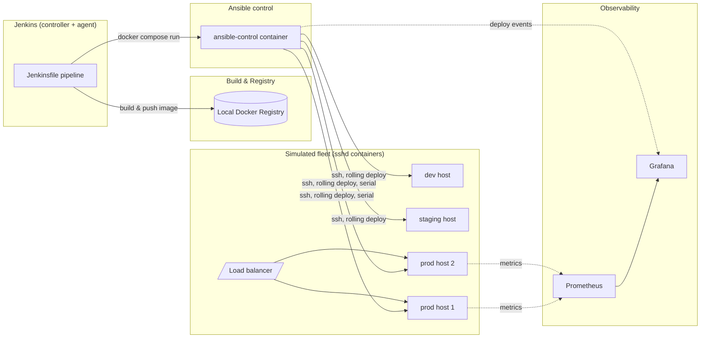

# Jenkins + Ansible + Docker Showcase

[](https://github.com/ykpraveen/jenkins-ansible-sample/actions/workflows/verify.yml)

A self-contained, production-style CI/CD sandbox: Jenkins builds and tests a small app,
Ansible deploys it across a simulated dev/staging/prod fleet with rolling updates and
automatic rollback, and Prometheus/Grafana make the deploys observable. Everything runs
as Docker containers — no Ansible, Jenkins, or Python install required on the host, only
Docker and Docker Compose.

## Why this exists

A portfolio piece meant to demonstrate real CI/CD practices, not just "Jenkins says hello
world": realistic host topology over SSH, environment promotion with a manual/automatic
gate, secrets handled via Ansible Vault, a rollback path that actually gets exercised by a
deliberately broken deploy, and a dashboard that makes that rollback visible.

## Architecture



## Design decisions worth knowing before you read the code

- **Docker-outside-of-Docker (docker.sock mount), not dind.** The Jenkins agent and the
  `ansible-control` container reach Docker by mounting the host's `docker.sock`, not via
  an isolated `dind` sidecar. Simpler and lower-overhead, but it also means those
  containers have root-equivalent access to the host's Docker daemon — a real, known
  tradeoff in actual CI setups, chosen here deliberately for simplicity.
- **Simulated fleet, not the local Docker daemon.** The dev/staging/prod "hosts" are
  containers running sshd — Ansible reaches them over real SSH, the way it would reach
  actual VMs, rather than via `docker exec` shortcuts.
- **No installs on the host beyond Docker.** Ansible, linters, and molecule all run inside
  a dedicated `ansible-control` image; the app's own lint/test stage runs inside its
  multi-stage Dockerfile. The only host prerequisite anywhere this is run is Docker +
  Docker Compose.
- **Fleet hosts run `privileged: true` with their own nested Docker daemon.** The
  `docker_engine` Ansible role installs Docker onto each simulated host for real, the way
  it would on an actual VM — which only works if the container hosting that "VM" can run
  its own dockerd. This is the same pattern tools like Molecule use to test infra roles.
- **No TLS anywhere — deliberately, not by oversight.** There's no domain to issue a real
  certificate for, and nothing here is internet-facing: the registry runs as an explicit
  "insecure registry," and the Traefik dashboard runs with `insecure: true`. Fine for a
  local sandbox; would need real certs (e.g. Let's Encrypt via Traefik's ACME resolver) if
  this ever left localhost.
- **No systemd on the fleet hosts, so `docker_engine` supervises dockerd itself.** These
  containers run `sshd` as PID 1, not an init system, so there's no service manager to
  hand the installed Docker daemon to. The role starts/restarts it with a plain
  `nohup`'d background process instead of `systemd`/`service`.
- **The app runs with `--network host` on the fleet host.** Traefik's routing labels
  (`traefik.enable=true`, etc.) are attached to the `fleet-prod1`/`fleet-prod2` *Compose*
  containers, not to the app container Ansible starts inside their nested Docker daemon.
  Running the app with `--network host` puts it directly in that outer container's
  network namespace, which is what makes it reachable at the labeled port at all.
- **Secrets via `ansible-vault`, keyed off one env var.** `ansible.cfg` points
  `vault_password_file` at `ansible/vault_pass.sh`, a script that just echoes
  `$ANSIBLE_VAULT_PASSWORD` — set it locally to run playbooks by hand, and the same env
  var feeds a Jenkins credential in CI. The password itself is never written to disk in
  this repo; only the tiny script that reads it from the environment is committed.
- **CI via GitHub Actions.** `.github/workflows/verify.yml` brings up the fleet, registry,
  and Traefik on every push, builds and unit-tests the app, and runs the Ansible layer
  against it end-to-end, including a deliberately-broken deploy to prove the rollback
  logic actually works — the badge at the top reflects that real check, not just a build.

## Quick start

Prerequisite: Docker + Docker Compose. `ssh-keygen` is also used once, locally, to
generate the fleet's SSH keypair — it ships standard on virtually every Unix-like system
(and Git Bash on Windows).

```bash
git clone <this repo>
cd jenkins-ansible-sample
./scripts/setup.sh      # generates secrets/ssh/id_ed25519 (gitignored, never committed)
docker compose up -d --build
```

**On WSL2:** clone this onto the native Linux filesystem (e.g. `~/jenkins-ansible-sample`),
not a Windows drive mount like `/mnt/c/...`. Windows-mounted paths don't enforce real Unix
file permissions, so the generated SSH private key will look "world-readable" to `ssh` no
matter what `chmod` says, and it'll silently fall back to a password prompt instead of key
auth. `scripts/setup.sh` prints a warning if it detects this.

This brings up:

| Service | How to reach it |
|---|---|
| Registry | `http://localhost:5000/v2/` |
| Traefik dashboard | `http://localhost:8082` |
| Traefik (app traffic) | `http://localhost:8081` |
| Fleet hosts (SSH) | `ssh -i secrets/ssh/id_ed25519 -p 2201 ansible@localhost` (dev), `2202` (staging), `2211`/`2212` (prod1/prod2) |
| Jenkins | `http://localhost:8080` — separate `--profile tools` build, see "The Jenkins layer" |
| Prometheus / Grafana | separate `--profile observability` build, see "Observability" |

## The sample app

`app/` is a minimal Flask app with two endpoints: `GET /health` (returns 500 if the
`SIMULATE_FAILURE=true` environment variable is set — the hook the rollback demo below
uses to deploy a deliberately broken instance) and `GET /version` (reports
`APP_VERSION`/`GIT_SHA`, baked in at build time via `--build-arg`, so a rolling deploy can
be proven to have actually rotated instances).

The Dockerfile is multi-stage: a `test` stage installs `pytest` and runs the unit tests,
and the default (`final`) stage copies its app code *from the test stage's output* — so a
plain `docker build ./app` cannot produce an image without the tests having passed first.
Dependencies are managed with [`uv`](https://docs.astral.sh/uv/) (`pyproject.toml` + a
committed `uv.lock`) rather than `pip`, so builds resolve from an exact, hash-locked
dependency set instead of loosely pinned `requirements.txt` files. Regenerate the lock
after changing dependencies:

```bash
docker run --rm -v "$(pwd)/app:/app" -w /app ghcr.io/astral-sh/uv:0.5.11 lock
```

```bash
docker build --target test ./app          # just run the unit tests
docker build -t sample-app ./app          # full build (tests run as a precondition)
docker run --rm -p 8080:8080 sample-app   # then curl localhost:8080/health, /version
```

## The Ansible layer

`ansible/` holds everything: `bootstrap.yml` (roles `common` + `docker_engine`, run once
per host to prep it) and `deploy.yml` (role `app_deploy`, run repeatedly, one environment
at a time via `--limit`). Nothing here runs on the host — it's all invoked through the
`ansible-control` image:

```bash
export ANSIBLE_VAULT_PASSWORD=...          # see "Vault secrets" below
docker compose run --rm ansible-control ansible-playbook bootstrap.yml
docker compose run --rm ansible-control ansible-playbook deploy.yml --limit dev -e app_deploy_app_image_tag=ci
docker compose run --rm ansible-control ansible-lint bootstrap.yml deploy.yml
docker compose run --rm ansible-control bash -c "cd roles/common && molecule test"
```

**Vault secrets:** `app_secret_key` is sourced from `ansible/group_vars/all/vault.yml`, an
`ansible-vault`-encrypted file that's already committed. Set `ANSIBLE_VAULT_PASSWORD` to
the matching password to run playbooks against it. Setting up your own vault from scratch
(e.g. on a fork) looks like this:

```bash
cp ansible/group_vars/all/vault.yml.example ansible/group_vars/all/vault.yml
# edit ansible/group_vars/all/vault.yml with a real value
export ANSIBLE_VAULT_PASSWORD=pick-a-password
docker compose run --rm --user "$(id -u):$(id -g)" ansible-control ansible-vault encrypt group_vars/all/vault.yml
```

`--user "$(id -u):$(id -g)"` matters here: `ansible-control` runs as root by default, and
without it the encrypted file comes back root-owned on your host (via the bind mount),
which then makes `git add` fail with "permission denied." If that already happened to
you, `sudo chown "$(id -u):$(id -g)" ansible/group_vars/all/vault.yml` fixes it. (The
service also sets `HOME=/tmp` so Ansible has somewhere writable for its own per-run temp
files when running as an arbitrary non-root UID like this.)

To have the GitHub Actions workflow exercise the Ansible layer too, add
`ANSIBLE_VAULT_PASSWORD` (the same password) as a repository secret.

### Rollback / failure injection

`app_deploy` records the currently-running image reference to
`/opt/app_deploy_last_known_good` on the target host *before* touching anything, then
deploys the requested image and runs a post-deploy health check. If that health check
never passes, the role:

1. stops the failed container,
2. starts the last-known-good image in its place (with `SIMULATE_FAILURE` forced off, so
   the rollback can't itself be marked broken by a stale flag left over from the bad
   deploy),
3. re-runs the same health check against the rollback, and
4. still fails the Ansible play — a bad deploy is always reported as a failure, even
   though the host it targeted is left healthy.

`deploy.yml` sets `any_errors_fatal: true` on every play, so a failed (and rolled-back)
dev deploy stops the pipeline before staging or prod are ever touched. If no
last-known-good image was ever recorded (i.e. this is the very first deploy to that
host), there's nothing to roll back to: the play fails and the broken container is left
running rather than removed and replaced with nothing.

**Try it by hand**, once dev already has a working deploy:

```bash
docker compose run --rm ansible-control ansible-playbook deploy.yml --limit dev \
  -e app_deploy_app_image_tag=ci -e app_deploy_simulate_failure=true
```

This run fails — that's expected, it's the point — but `curl`ing dev's `/health`
afterward comes back `200` again. `.github/workflows/verify.yml` runs exactly this as its
CI check, and if the observability stack (below) is running, watch the Grafana dashboard
while you run it to see the rollback happen live.

## The Jenkins layer

`jenkins/` holds a controller image (`jenkins/controller/`, plugins pinned in
`plugins.txt`, config-as-code only — the setup wizard is disabled) and an agent image
(`jenkins/agent/`) that's really just the `ansible-control` recipe again plus a JRE and
`git`. There's no static agent: the controller's Docker Cloud config
(`jenkins/casc/jenkins.yaml`) launches agents on demand, one per running build, as
sibling containers via the same `docker.sock` bind-mount trick `ansible-control` uses
(DooD). Agents connect over `attach` (`docker exec`, driven by the Docker API) rather than
JNLP or SSH — this sidesteps the usual chicken-and-egg problem of needing a per-agent
secret or key already in place before the agent can start.

`Jenkinsfile` at the repo root is the pipeline: lint (`yamllint`, `ansible-lint`,
`hadolint`) → `molecule test` for the `common` role → build & unit test → push to the
registry → deploy dev → deploy staging → a promotion gate → deploy prod (rolling,
`serial: 1`). It's one pipeline run per image, not per-environment jobs — dev/staging/prod
are stages, so the image promoted to prod is provably the one smoke-tested earlier in the
same run.

**Molecule in CI:** the `Molecule (common role)` stage runs `molecule test
--destroy=always` against `ansible/roles/common`, using the same docker.sock-mounted DooD
setup as the deploy stages' `ansible-playbook` calls. `--destroy=always` matters
specifically because molecule's test container (`common-test`) is a *sibling* of the
Jenkins agent container, not something nested inside it — if an earlier step in the test
sequence fails and destroy is skipped, that container would outlive the ephemeral agent
it was spawned from and leak on the host indefinitely across builds.

**Promotion gate toggle:** the `AUTO_PROMOTE` build parameter (`booleanParam`, defaults to
`false`) controls whether "Promote to prod?" is a manual `input` step or skipped
entirely. Either way, prod is never reached on a bad build — staging's own post-deploy
health check (the `app_deploy` role's fail/rollback logic above) already fails the
pipeline before this stage is ever reached, so "automatic" only means skipping the human
approval click, not skipping verification. Trigger it via "Build with Parameters" in the
Jenkins UI, or from the CLI:

```bash
curl -u "$JENKINS_ADMIN_ID:$JENKINS_ADMIN_PASSWORD" \
  "http://localhost:8080/job/jenkins-ansible-sample-deploy/buildWithParameters?AUTO_PROMOTE=true"
```

**One-time setup:**

```bash
docker compose build jenkins-agent-image     # tags jenkins-ansible-sample-agent:latest,
                                              # which the Docker Cloud template launches
export JENKINS_ADMIN_ID=admin
export JENKINS_ADMIN_PASSWORD=pick-a-password
export ANSIBLE_VAULT_PASSWORD=...            # same value as the Ansible layer's vault password
docker compose --profile tools up -d jenkins-controller
```

Then open `http://localhost:8080`, log in with the admin credentials above, and the seed
job (`jenkins-ansible-sample-deploy`, defined declaratively via `job-dsl` in
`jenkins/casc/jenkins.yaml`) is already there, pointed at this repo's `Jenkinsfile` on
`main` — no click-ops needed to create it.

Credentials (`fleet-ssh-key`, `ansible-vault-password`) are also defined in
`jenkins/casc/jenkins.yaml`, sourced the same way: JCasC's secret resolver checks the
`jenkins-controller` container's environment first, then falls back to reading a file
under `/run/secrets/` — which is where the fleet SSH private key is bind-mounted, since
it's multi-line key material rather than something you'd export as an env var.

**Registry push fails with a DNS timeout on WSL2** (`dial tcp: lookup registry on
10.255.255.254:53: ... i/o timeout`, right after `docker push registry:5000/...`): the
Jenkins agent is DooD (see above), so `docker push` isn't actually executed by the agent
container — it's executed by the **daemon** on the other end of the socket, in the
daemon's own network namespace. The agent container is attached to `fleet_net` and can
resolve `registry` fine, but that's irrelevant: the docker daemon running on the WSL2 host
itself is not on `fleet_net`, so it falls back to the host's resolver, which has never
heard of `registry`, and times out. (This is not the same problem the fleet hosts have:
they run their own *nested* dockerd inside a container that genuinely is attached to
`fleet_net`, so `registry:5000` resolves correctly for them at deploy time.)

This only bites when Docker on the WSL2 box is the native Engine (not Docker Desktop,
which runs dockerd in its own separate VM and needs a different fix). The one-time fix,
run on the WSL2 host itself, not in any container:

```bash
echo "127.0.0.1 registry" | sudo tee -a /etc/hosts
```

`registry`'s port is already published to the host (`5000:5000` in `docker-compose.yml`),
so this just lets the daemon find it by name. This line can be wiped if WSL2 regenerates
`/etc/hosts` on restart — if it disappears, either re-add it or set `generateHosts = false`
under `[network]` in `/etc/wsl.conf`.

## Observability

Opt-in via `--profile observability` (kept out of the default `docker compose up` to keep
the Quick Start's container count down):

```bash
docker compose --profile observability up -d
```

This brings up:

| Service | How to reach it | What it does |
|---|---|---|
| Prometheus | `http://localhost:9090` | scrapes cadvisor + node-exporter, see `docker/prometheus/prometheus.yml` |
| Grafana | `http://localhost:3000` (login `admin`/`admin`) | provisioned, not click-ops — see below |
| cadvisor | internal only (`cadvisor:8080`) | per-container CPU/memory for this compose stack's own containers |
| node-exporter | internal only (`node-exporter:9100`) | host-level CPU/memory/filesystem |

**Provisioning, not click-ops.** `docker/grafana/provisioning/` wires up the Prometheus
datasource and a "Fleet Overview" dashboard (`docker/grafana/dashboards/overview.json`)
automatically at container start, the same philosophy as the Jenkins seed job. The
dashboard has four panels — fleet container CPU/memory (from cadvisor) and host
CPU/memory (from node-exporter) — plus a built-in Grafana annotation query filtered to
the `deploy` tag.

**Deploy events as annotations, not a separate metric.** `app_deploy`'s tasks (see
`ansible/roles/app_deploy/tasks/main.yml`) POST to Grafana's `/api/annotations` after
every deploy attempt — success or failed-and-rolled-back — tagged `deploy`, the
environment name, and `success`/`rollback`. This is what makes a rollback visually
obvious on the dashboard: watch the panels while you run the rollback demo above and a
marker for the `rollback`-tagged annotation appears across all four panels at the moment
it happened. The call is guarded both ways — `app_deploy_grafana_annotate: true` by
default (set `-e app_deploy_grafana_annotate=false` to skip it entirely) and
`failed_when: false` (an unreachable Grafana, e.g. when this profile isn't running, never
fails a deploy over it).

**cadvisor/node-exporter are containerized, not `network_mode: host`.** Both read real
host data via bind-mounted `/proc`, `/sys`, and `/` (or the outer `docker.sock`), so
CPU/memory/filesystem metrics are accurate — but neither uses host networking, so
network-interface metrics (if you go looking) reflect each container's own veth, not the
real host NIC. Also, cadvisor doesn't mount `/dev/kmsg` (may not exist under WSL2) — it
still starts fine without it, just skips the one collector that needs it and logs a
warning.

## Not in scope

- Kubernetes — deploys are deliberately VM/host-style via Ansible, not k8s
- Multi-cloud / real cloud provisioning — the fleet stays local/simulated
- Blue-green deploys — rolling deploy + health-check rollback is the chosen pattern
